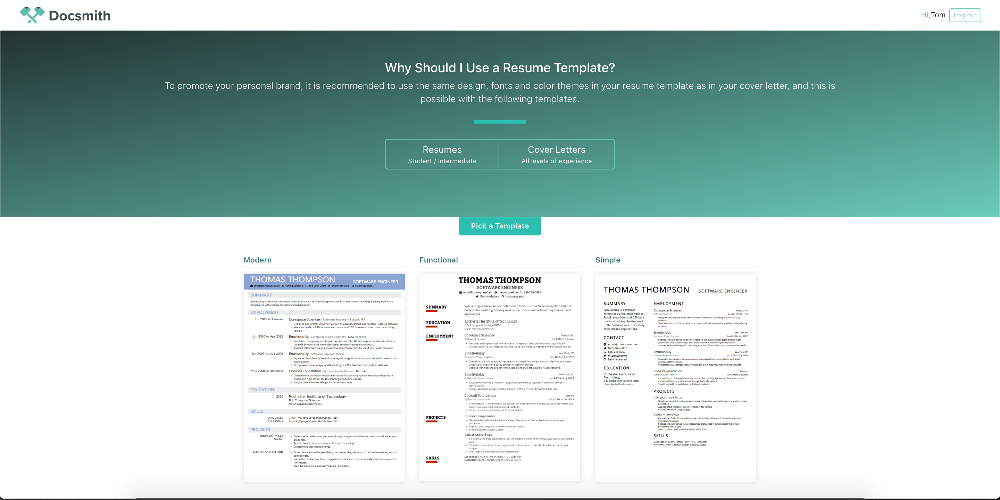

### Q3 Project : Tom and Clarance\*

Home Page

Resume Template

Cover Letter Template

#### _A project description:_

Web resume/cover letter builder. Our project will remove the hassle out of resume and cover letter writing. Use can choose from several templates and follow easy prompts to create the perfect job-ready resume and cover letter effortlessly.

#### _Who uses it?_

Everybody who needs a resume or cover letter

#### _What outputs do they need?_

Job-ready resume and cover letter.

#### _What inputs are needed to generate those outputs?_

Clients information which they what to have on a resume and cover letter.

#### _A list of technologies that you plan to use_

HTML, CSS, React.js
\*Stretch Backend: Node, Express.js, Postgres db

#### _Features:_

When user visit page he can choose what kind of design want to have on resume.
When user visit page he can choose what kind of design want to have on cover letter.
When user selected a design he will get “/template” page
User can enter his information on resume and change color
User can enter his information on cover letter
User can export resume and cover letter as PDF file or print it from page.

#### Stretch:

*User login
*Saving resume in users profile
\*Add more document templates
